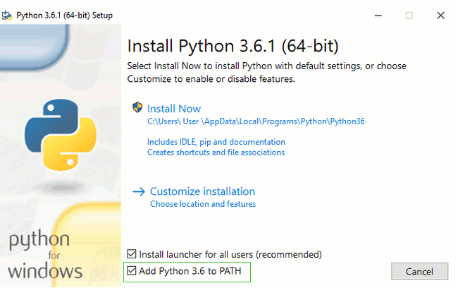

#### Версия интерпретатора {#python-version}

После установки python, корректность и версию результата можно проверить коммандой `python -V`(`V` - обязательно в верхнем регистре)
В Unix python(обычно) доступен без дополнительных действий. Стандартная комманда `python` может ссылаться как на вторую версию, так и на третью, в зависимости от дистрибутива. В некоторых случаях, если доступны оба варианта, можно явно указать желаемую версию с помощью `python2` или `python3`

```
[sergey@home ~]$ python -V
Python 3.6.4
[sergey@home ~]$ python3 -V
Python 3.6.4
[sergey@home ~]$ python2 -V
Python 2.7.14
```

#### Запуск и выход {#start-and-exit}

Без дополнительных аргументов, `python` запускает сеанс интерактивной работы с интерпретатором. В нем недоступны стандартные комманды терминала - ниже можно увидеть пример ошибки при неправильном использовании интерпретатора. Для возвращения в системную консоль необходимо набрать `exit()` и нажать <kbd>Enter</kbd>(также могут помочь <kbd>Ctrl+C</kbd> или <kbd>Ctrl+D</kbd>, в зависимости от используемой системы)

```
[sergey@home ~]$ python
Python 3.6.4 (default, Dec 23 2017, 19:07:07)
[GCC 7.2.1 20171128] on linux
Type "help", "copyright", "credits" or "license" for more information.
>>> cd
Traceback (most recent call last):
  File "<stdin>", line 1, in <module>
NameError: name 'cd' is not defined
>>> exit()
[sergey@home ~]$ cd
/home/sergey
[sergey@home ~]$
```

#### Значения {#values}

Интерактивный сеанс позволяет вводить код на python и, после нажатия <kbd>Enter</kbd>, показывает результат выполненной операции(если он есть)

```python
[sergey@home ~]$ python
Python 3.6.4 (default, Dec 23 2017, 19:07:07)
[GCC 7.2.1 20171128] on linux
Type "help", "copyright", "credits" or "license" for more information.
>>>
>>> 1
1
>>> 11
11
>>> 123
123
>>> 1234567876543212345678765432123456765432123456787654321
1234567876543212345678765432123456765432123456787654321
```

#### Выражения {#expr}

Код, который имеет результат, принято называть выражением(как минимум, я так делаю ☺)

```python
>>> 123 + 33
156
>>> 432 + 11
443
```

#### Ошибки {#errors}

Некорректные комманды вызывают ошибки, текст которых(зачастую) позволяет разобраться в проблеме.
Кроме того, некоторые записи, в корректность которых сложно поверить, могут оказаться вполне валидными - тут уже нужно привыкнуть к мышлению интерпретатора и првилам разбора кода в python

```python
>>> +
  File "<stdin>", line 1
    +
    ^
SyntaxError: invalid syntax
>>> 11 +
  File "<stdin>", line 1
    11 +
       ^
SyntaxError: invalid syntax
>>> 123 321
  File "<stdin>", line 1
    123 321
          ^
SyntaxError: invalid syntax

>>> +123
123
>>> + 11
11
>>> 1+2
3
>>> 2+2+3+4+5
16
>>> 2+++++++++2
4
>>> (2 + 2) + 2
6
>>> 2 + +2
4
>>> 2 + -2
0
>>> 2 - 2
0
>>> 2 + (+2)
4
>>> 2 + (+(+(+(+(2)))))
4
>>>
```

#### Переменные {#variables}

Для временного хранения результатов выражений принято использовать переменные. Для имени переменной можно использовать любой набор букв, цифр и нижних подчеркиваний(цифра не может быть первым символом). В дальнейшем, переменные можно перезаписывать новыми значениями. Процесс записи значения в переменную называют присваиванием

```python
>>> a = 1
>>> b = 2
>>> c = 3
>>> a
1
>>> b
2
>>> c
3
>>> 1 + 2
3
>>> a + b
3
>>> b + a
3
>>> z = a + b + c
>>> a
1
>>> b
2
>>> c
3
>>> z
6
>>> a = 10
>>> z
6
>>> a
10
>>> z = a + b + c
>>> z
15
>>> a + b
12
>>> a = 100
>>> a + b
102
>>> b = 0
>>> a + b
100
```

#### Инструкции {#statements}

Так же в python существует ограниченное количество конструкций - блоков кода, который не имеет результатов и, как следствие, не может быть присвоен в переменную. Обычно, инструкции бросаются в глаза, так что найти их будет несложно.

```python
>>> if 100 > 200:
...     100
...
>>> pass
>>> def f():
...    hello
...
```

> Скачать python можно с [официального сайта](https://www.python.org/downloads/windows/)
>
> [Пошаговое руководство](https://python-scripts.com/install-python-windows)
>
> PS. Напутствие автора: НЕ ЗАБУДЬТЕ ОТМЕТИТЬ ДОБАВЛЕНИЕ В PATH: 
